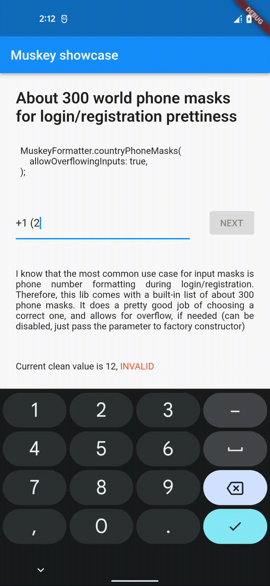

# Muskey

**_An actually useful pattern matcher and field input formatter library for Flutter._**

Muskey is a single-file light library inspired by [vue-the-mask](https://github.com/vuejs-tips/vue-the-mask) 
that's shown its usefulness throughout my projects, so I decided to share it with the world.

---

## A quick rundown on what this is

Imagine you're creating a login/registration page and need a nice formatting for phone inputs.

Well, **Muskey**'s got you covered:

```dart
// somewhere in your build method:

TextField(
  ...
  inputFormatters: [
    MuskeyFormatter.countryPhoneMasks(
      allowOverflowingInputs: true,
    ),
  ],
),
```

And that's it! Smart cursor positioning and dynamic mask switch make the ux nice and usable:



---

## But I want customizable stuff

You can customize a list of masks to use and which symbols inside the masks are to be treated like wildcards and decorators!

### Masks

For example, you can configure Muskey for credit card number formatting:

```dart
// somewhere in your build method:

TextField(
  ...
  inputFormatters: [
    MuskeyFormatter(
      masks: ['#### #### #### ####'],
      overflow: OverflowBehavior.forbidden(),
    ),
  ],
),
```

### Wildcards and decorators

You can also customize wildcards and decorators like so:

```dart
// somewhere in your build method:

TextField(
  ...
  inputFormatters: [
    MuskeyFormatter(
      masks: ['%^##-####-####-####'],
      decorators: ['-'],
      wildcards: {
        '%': RegExp('[4-6]'),
        '^': RegExp('[1-2]'),
      },
      overflow: OverflowBehavior.forbidden(),
    ),
  ],
),
```

This will only accept inputs with the first digit being 4, 5 or 6 and the second digit being 1 or 2.

### Character transforms

You can specify transforms to be applied during typing. These characters are looked for 
inside the given mask and applied against the actual input.

```dart
TextField(
  ...
  inputFormatters: [
    MuskeyFormatter(
      masks: ['@@@@@'],
      wildcards: {
        '@': RegExp('[a-zA-Z]'),
      },
      transforms: {
        '@' : (s) => s.toUpperCase(),
      },
      overflow: OverflowBehavior.forbidden(),
    ),
  ],
),
```

### Overflow

You can also specify whether to allow inputs that are longer than any of the given masks by specifying `overflow` parameter.
Here's a custom setup with only German phone masks and demonstration of how `overflow` works:

```dart
MuskeyFormatter(
  masks: [
    "+49 (####) ###-####",
    "+49 (###) ###-####",
    "+49 (###) ##-####",
    "+49 (###) ##-###",
    "+49 (###) ##-##",
    "+49-###-###",
  ],
  overflow: OverflowBehavior(
    allowed: overflowAllowed,
    overflowOn: RegExp('[0-9]'),
  ),
)
```


### Autofill

You can enable an autofill feature to allow filling of pre-defined values in your masks.

Use it wisely! If you enable this feature, make sure your mask set is either a single mask or 
has a common starting pattern (like german masks above)!

```dart
MuskeyFormatter(
  masks: ["+380 (##) ###-##-##"],
  allowAutofill: true,
);
```


---

## A small discussion on design

This formatter is *stateless* by design. It does support detecting the validity of your masks,
but if you want updates on it, you need to create your own ways of doing that. For example, you can get
current formatter info value inside of onChanged callback in your TextField,
add a listener on your TextEditingController or any other way.

### Usage:

Create an instance of this class either inside your StatefulWidget, or
directly in your [build] method, and place it in [inputFormatters]
list of your [TextField]. Provide a non-empty list of masks to work with,
customize if needed.
